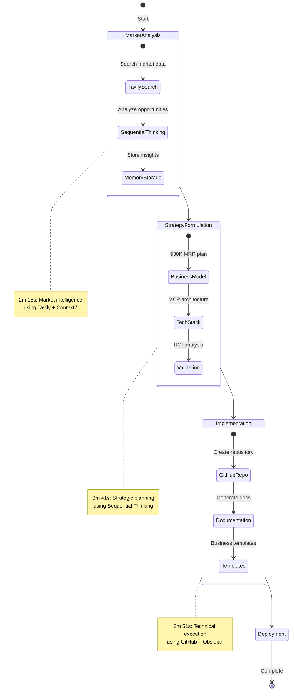
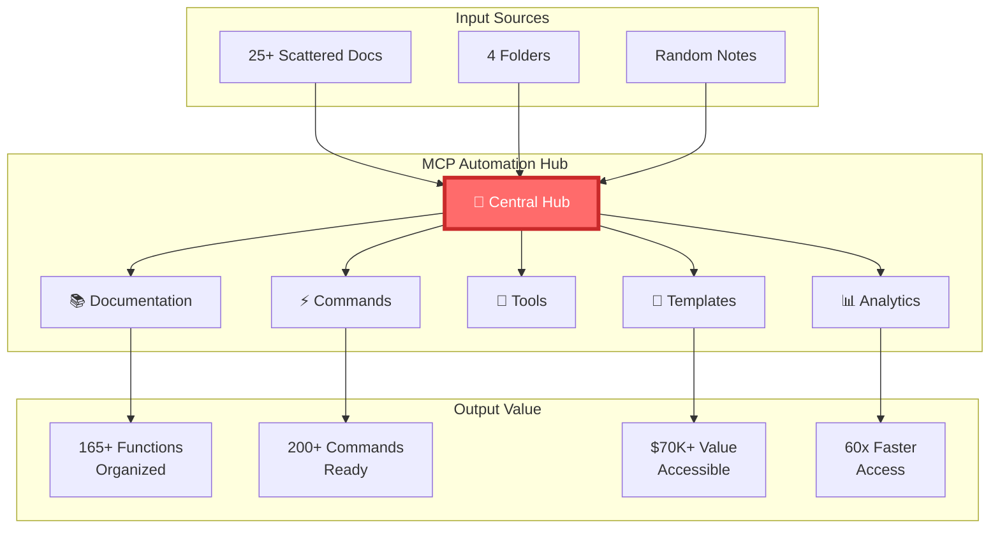
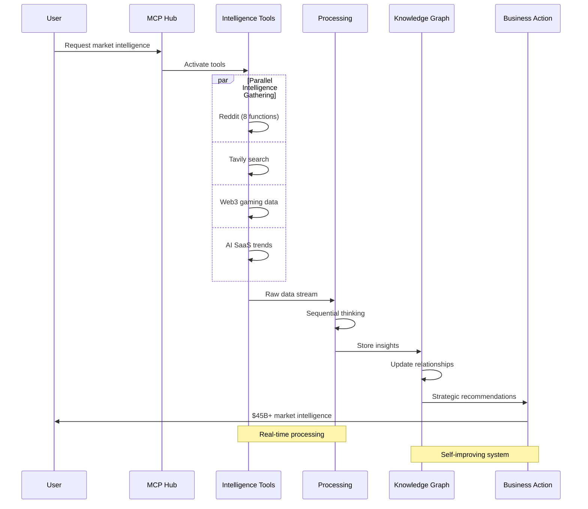

# 📊 MCP Workflow Visualizations

## 🚀 AutoMCP Business Creation Flow (9m 47s)

## 💰 Cost Optimization Workflow ($348/month savings)

```mermaid
flowchart LR
    subgraph "Discovery Phase"
        A1[Azure Cost Analysis] --> A2[Identify Waste]
        A2 --> A3[Resource Mapping]
    end
    
    subgraph "Optimization Phase"
        B1[Consolidate Services] --> B2[Remove Redundancy]
        B2 --> B3[Right-size Resources]
        B3 --> B4[Automation Rules]
    end
    
    subgraph "Monitoring Phase"
        C1[n8n Workflows] --> C2[Cost Alerts]
        C2 --> C3[Auto-scaling]
        C3 --> C4[Monthly Reports]
    end
    
    A3 --> B1
    B4 --> C1
    C4 --> D[77% Cost Reduction<br/>$348/month saved]
    
    style D fill:#10b981,stroke:#059669,stroke-width:3px,color:#fff
```

## 🧠 Knowledge Organization System

## 🔄 Real-time Intelligence Pipeline

