# 📊 MCP Workflow Visualizations

## 🚀 AutoMCP Business Creation Flow (9m 47s)

## 💰 Cost Optimization Workflow ($348/month savings)

## 🧠 Knowledge Organization System

```mermaid
graph TB
    subgraph "Input Sources"
        IS1[25+ Scattered Docs]
        IS2[4 Folders]
        IS3[Random Notes]
    end
    
    subgraph "MCP Automation Hub"
        HUB[🚀 Central Hub]
        DOC[📚 Documentation]
        CMD[⚡ Commands]
        TOOL[🔧 Tools]
        TEMP[🎯 Templates]
        ANAL[📊 Analytics]
    end
    
    subgraph "Output Value"
        OUT1[165+ Functions<br/>Organized]
        OUT2[200+ Commands<br/>Ready]
        OUT3[$70K+ Value<br/>Accessible]
        OUT4[60x Faster<br/>Access]
    end
    
    IS1 --> HUB
    IS2 --> HUB
    IS3 --> HUB
    
    HUB --> DOC
    HUB --> CMD
    HUB --> TOOL
    HUB --> TEMP
    HUB --> ANAL
    
    DOC --> OUT1
    CMD --> OUT2
    TEMP --> OUT3
    ANAL --> OUT4
    
    style HUB fill:#ff6b6b,stroke:#c92a2a,stroke-width:4px,color:#fff
```

## 🔄 Real-time Intelligence Pipeline

